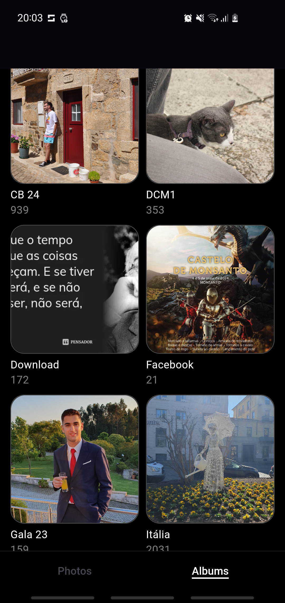
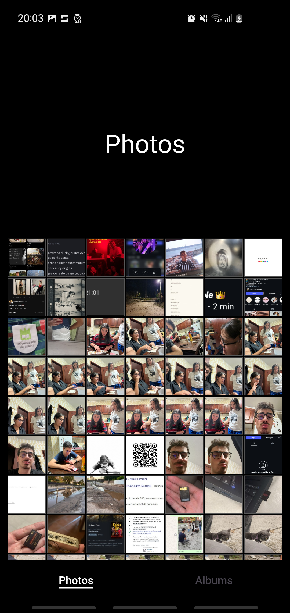
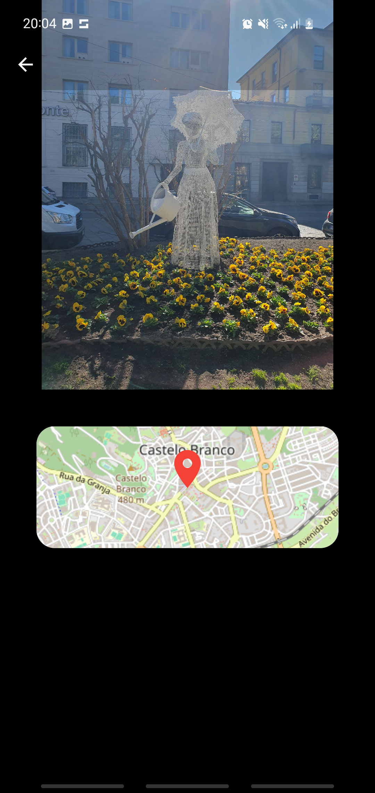

# CM Flutter Homework - Gallery
# Author: Guilherme Antunes - 103600

## Description
The Gallery application was designed to clone some of the functionalities of the Samsung Gallery app. The main navigation is made using non-scrollable tabs and the subsequent pages use the Navigator widget to navigate between them. Some lists are used to display the albums and photos retrieved with the photo_manager dependency and photo_view is used to display and interact with each of the images displaying a mocked location for each photo using flutter_map. Either the albums page or any page with images can switch the amount of albums/images displayed in the page by pinching in or out the page with the fingers. The application works in both orientations.

## Screenshots

<p float="left">
  
   
  
</p>

## Requirements
- Flutter SDK
- ```flutter doctor``` must run without issues

## Installation
Before executing the project dependencies must be installed with
```bash
flutter pub get
```
## Running the Application
The Gallery app was developed to run **only on android devices** so after you run the command ...
```bash
flutter run
```
... you **must select an android device**, real or emulated, which preferably has images and albums in memory, like a personal phone.

## Building the APK
To compile the project in order to build an apk file to be installed on an android the following command must be run.
```bash
flutter build apk
```
